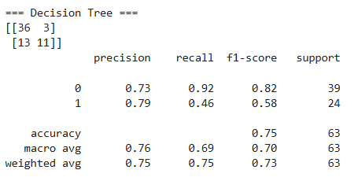

# Project -> HR-Data-Analysis
A business analytics case study analyzing employee attrition trends, satisfaction, and diversity using Power BI, SQL, and Python. This project involves descriptive and predictive analytics with the goal of improving HR decision-making.

## Table of Contents
- [Objective](#objective)
- [Business Questions](#business-questions-answered)
- [Data Cleaning](#data-cleaning--preparation)
- [Data Analysis using SQL](#data-analysis-using-sql)
- [KPIs](#key-performance-indicators-kpis)
- [Dashboards](#dashboard-preview)
- [Python Analysis](#python-analysis)
- [Key Insights](#key-insights)
- [References](#references)

## Case Background  
A mid-sized company is facing challenges related to:

- High employee turnover
- Limited insight into diversity and pay equity
- Inconsistent hiring outcomes
  
**Tools used:** SQL • PowerBI • Python • GitHub

## Objective
To support HR managers and business leaders in reducing attrition, identifying key performance and satisfaction drivers, and gaining clarity on hiring sources, diversity, and pay equity.

### Business Questions Answered
1. What is the company's current attrition rate, and how does it differ by department?
2. What are the top reasons employees are leaving?
3. Does shorter tenure significantly increase attrition risk?
4. Are there any gender or pay equity concerns across roles and departments?
5. Which recruitment sources are associated with higher employee turnover?
6. How do satisfaction, engagement, and performance scores correlate with attrition?
7. Can we accurately predict which employees are likely to leave next?

### Key Performance Indicators (KPIs) 📊
| KPI                                  | Description                                      |
| ------------------------------------ | ------------------------------------------------ |
| **Total Employees**                  | Total number of employees in the dataset         |
| **Active Employees**                 | Employees currently employed (not terminated)    |
| **Attrition Rate (%)**               | % of employees who have left                     |
| **Avg. Satisfaction Score**          | Self-reported employee satisfaction              |
| **Male/Female Ratio**                | Gender distribution across company               |

### Areas of Analysis & Visualizations
- Overall Attrition Rate
- Termination Reasons – most common exit causes
- Attrition by Department & Position – where are exits happening most?
- Recruitment Source Analysis – which sources produce longer-term employees
- Insights on Attrition Recruitment Sources
- Gender & Race Diversity – breakdowns across departments
- Average Salary by Gender & Role – pay equity investigation
- Age Bucket - What age range do employees fall in?
- Tenure Analysis – how long employees stay before leaving
- Satisfaction vs Attrition – do low scores predict exits?
- Predictive Model Results – accuracy + key predictors of attrition

### Data Cleaning & Preparation
- Checked for blanks and duplicates
- Removed unnecessary fields
- Ensured correct data types
- Converted date columns to SQL-friendly formats
- Handled null values for satisfaction, survey, termination dates
- After initial cleaning, the data was imported in SQL for insights

### Data Analysis using SQL
```sql
Total Employees
SELECT COUNT(EmpID) FROM hr_data;
```
```sql
Active Employees
SELECT COUNT(*) FROM hr_data WHERE EmploymentStatus = 'Active';
```
```sql
Attrition Rate (%)
SELECT ROUND(SUM(CASE WHEN Termd = 1 THEN 1 ELSE 0 END) / COUNT(*) * 100, 2) AS attrition_rate FROM hr_data;
```
```sql
Avg Employee Satisfaction
SELECT ROUND(AVG(EmpSatisfaction), 2) AS avg_emp_satisfaction_rating FROM hr_data;
```
```sql
Gender Count
SELECT Sex, COUNT(*) AS gender_count FROM hr_data GROUP BY Sex;
```
```sql
Gender Distribution Across Departments
SELECT 
    Department,
    Sex AS Gender,
    COUNT(*) AS Num_Emp,
FROM hr_data
GROUP BY Department, Sex
ORDER BY Department, Sex;
```
```sql
Avg Salary by Gender
SELECT Sex AS Gender, AVG(Salary) AS avg_salary FROM hr_data GROUP BY Sex;
```
```sql
Age Bucket Distribution
SELECT
    COUNT(*) AS emp_count,
    CASE 
        WHEN TIMESTAMPDIFF(YEAR, DOB, '2020-01-01') BETWEEN 18 AND 25 THEN '18-25'
        WHEN TIMESTAMPDIFF(YEAR, DOB, '2020-01-01') BETWEEN 26 AND 35 THEN '26-35'
        WHEN TIMESTAMPDIFF(YEAR, DOB, '2020-01-01') BETWEEN 36 AND 45 THEN '36-45'
        WHEN TIMESTAMPDIFF(YEAR, DOB, '2020-01-01') BETWEEN 46 AND 60 THEN '46-60'
        ELSE '60+'
    END AS age_bucket
FROM hr_data
GROUP BY age_bucket
ORDER BY age_bucket;
```
```sql
Most Common Termination Reasons
SELECT 
    TermReason, 
    COUNT(*) AS emp_count 
FROM hr_data 
WHERE Termd = 1 
GROUP BY TermReason 
ORDER BY emp_count DESC;
```
```sql
Attrition by Recruitment Source (Hotspots)
SELECT 
    RecruitmentSource,
    COUNT(*) AS terminated_count
FROM hr_data 
WHERE Termd = 1 
GROUP BY RecruitmentSource 
ORDER BY terminated_count DESC;
```
```sql
Attrition by Department
SELECT 
    Department, 
    COUNT(CASE WHEN Termd = 1 THEN 1 END) AS terminated
FROM hr_data
GROUP BY Department
ORDER BY Department DESC;
```
 
### What’s Next ❓
This project was completed using both visual tools (PowerBI) and code-driven analysis (Python) to provide a full-stack business intelligence solution.
Additional deep-dives included:
 - Decision Tree Model - To predict attrition
 - Graphs on relation between Satisfaction, Performance and Attrition
  
### Dashboard Preview


### Python Analysis

#### 1. To predict which employees are likely to leave the company, I trained a Decision Tree classifier using features like:
     - Tenure
     - Engagement score
     - Satisfaction rating
     - Performance score
     - Department and position
     - Recruitment source

| Metric                  | Score |
| ----------------------- | ----- |
| **Accuracy**            | 75%   |
| **Precision (Leavers)** | 79%   |
| **Recall (Leavers)**    | 46%   |
| **F1-Score (Leavers)**  | 58%   |

Interpretation:
- The model correctly predicted 75% of employees.
- It was very good at predicting who will stay.
- It caught about half of the employees who actually left, useful as a risk flag, though not perfect.

Below is a visual diagram of the decision tree used to classify employee attrition. The tree shows that low tenure, low engagement, and certain roles or hiring sources are key indicators of attrition risk.



#### 2. Satisfaction vs. Attrition - analyzed how employee satisfaction impacts attrition.


| Satisfaction Score | Attrition Rate |
| ------------------ | -------------- |
| 1 (Very Low)       | 0.00           |
| 2 (Low)            | 44.4%          |
| 3 (Neutral)        | 30.6%          |
| 4 (High)           | 40.4%          |
| 5 (Very High)      | 29.6%          |

#### 3. Performance Score vs. Attrition

| Performance Score | Description        | Attrition Rate       |
| ----------------- | ------------------ | -------------------- |
| 1                 | Low                | 30.8%                |
| 2                 | Meets Expectations | **55.6%**  (Highest) |
| 3                 | Exceeds            | 33.7%                |
| 4                 | Outstanding        | **21.6%**  (Lowest)  |


### Key Insights

1. The company's overall attrition rate is 33.44%, which is relatively high.
2. Production department experiences the highest attrition, with most exits coming from employees hired via Google Search and Indeed.
3. The most common reasons for leaving include: “Another position”, “More money”, and “Unhappy” — indicating external opportunities and dissatisfaction.
4. Employees with tenure less than 2.3 years are significantly more likely to leave, suggesting early-stage engagement and retention challenges.
5. There is a slight gender pay gap (M: $70.63K, F: $67.79K), and it’s also seen within the Production department — worth monitoring for equity.
6. Recruitment sources like Google Search, Indeed, and LinkedIn are associated with higher turnover.
7. Satisfaction score of 2 has the highest attrition rate (~44%), while score 5 shows the lowest (~29%).
8. Performance score of 2 (meets expectations) had the highest attrition (~56%), while top performers (score 4) had the lowest (~21%).
9. A Decision Tree model achieved 75% prediction accuracy — with key risk factors including low tenure, low engagement, and certain recruitment sources.
10. The model can be used as a risk-flagging tool to help HR proactively retain employees.

### References
[(https://www.youtube.com/watch?v=bYmcCTsP0Zg)]


